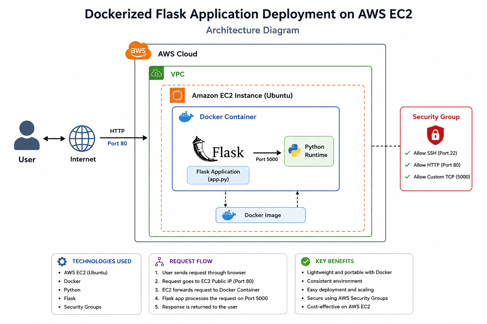
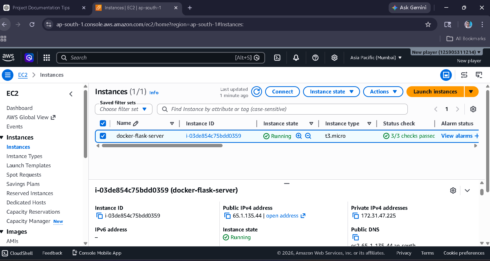
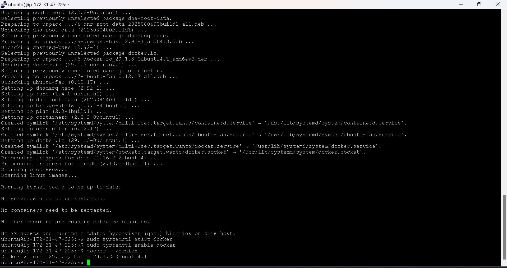
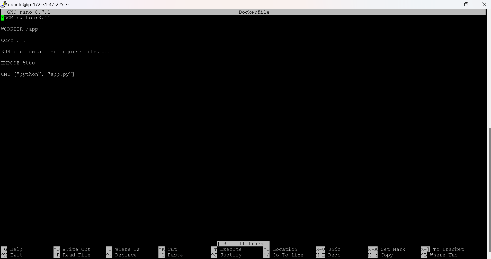
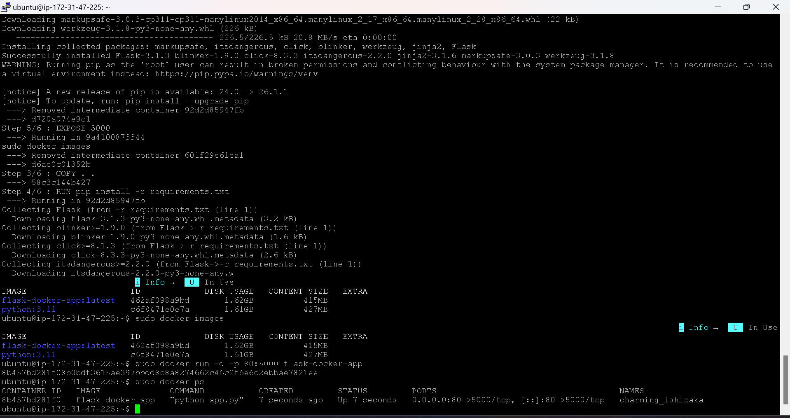
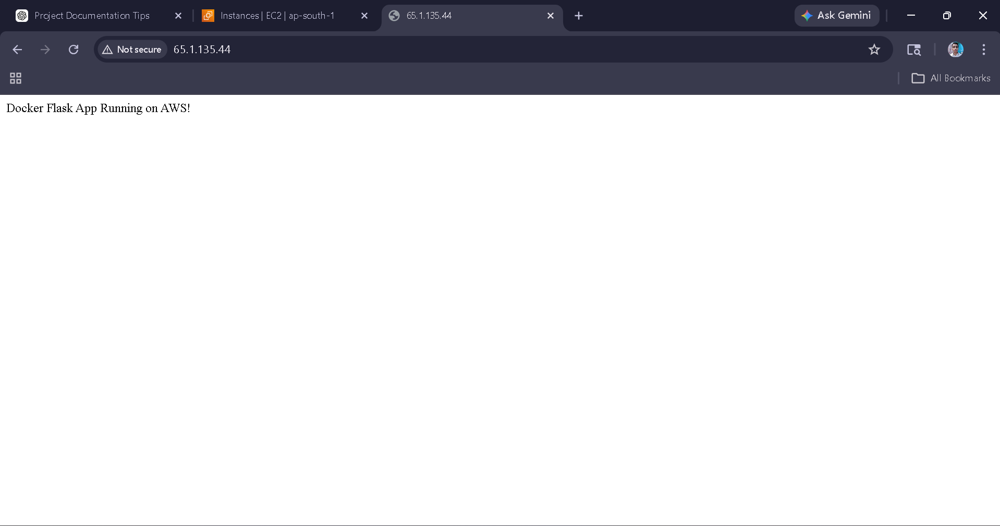

# 🚀 Dockerized Flask Application on AWS EC2

A production-style cloud deployment project where a Python Flask web application is containerized using Docker and deployed on an AWS EC2 Ubuntu server.

---

# 📌 Project Overview

This project demonstrates how to:

- Build a Flask web application
- Containerize the application using Docker
- Deploy the Docker container on AWS EC2
- Configure Linux server environment
- Expose the application through public IP access

The application runs inside a Docker container and is accessible through the browser using the EC2 public IP.

---

# 🏗️ Architecture Diagram



---

# ⚙️ Technologies Used

- Python
- Flask
- Docker
- AWS EC2
- Ubuntu Linux
- Git & GitHub

---

# 📂 Project Structure

```bash
docker-flask-aws-deployment/
│
├── app.py
├── requirements.txt
├── Dockerfile
├── README.md
├── architecture-diagram.png
│
└── screenshots/
```

---

# 🐳 Docker Workflow

## 1️⃣ Build Docker Image

```bash
sudo docker build -t flask-docker-app .
```

---

## 2️⃣ Run Docker Container

```bash
sudo docker run -d -p 80:5000 flask-docker-app
```

---

## 3️⃣ Verify Running Containers

```bash
sudo docker ps
```

---

# 📝 Application Code

## app.py

```python
from flask import Flask

app = Flask(__name__)

@app.route('/')
def home():
    return "Docker Flask App Running on AWS!"

if __name__ == '__main__':
    app.run(host='0.0.0.0', port=5000)
```

---

# 📦 requirements.txt

```text
Flask
```

---

# 🐋 Dockerfile

```dockerfile
FROM python:3.11

WORKDIR /app

COPY . .

RUN pip install -r requirements.txt

EXPOSE 5000

CMD ["python", "app.py"]
```

---

# 🌐 Application Output

Access the application in browser:

```text
http://YOUR_PUBLIC_IP
```

Expected Output:

```text
Docker Flask App Running on AWS!
```

---

# 📸 Project Screenshots

## EC2 Instance Running



---

## Docker Installed



---

## Docker Image Build



---

## Running Containers



---

## Browser Output



---

# 🔐 AWS Security Group Configuration

| Type       | Port |
| ---------- | ---- |
| SSH        | 22   |
| HTTP       | 80   |
| Custom TCP | 5000 |

---

# 🚀 Features

- Dockerized Flask application
- AWS EC2 deployment
- Linux server configuration
- Containerized environment
- Public browser accessibility
- Lightweight and scalable setup

---

# 📚 Learning Outcomes

Through this project, I learned:

- Docker fundamentals
- Container creation and deployment
- AWS EC2 server management
- Linux command-line operations
- Flask application deployment
- Port mapping and networking

---

# 🧠 Future Improvements

- Add Nginx reverse proxy
- Implement HTTPS with SSL
- Use Docker Compose
- Configure CI/CD pipeline
- Deploy with Kubernetes

---

# 👨‍💻 Author

## Mohammed Maaz

- GitHub: https://github.com/Mohammed-Maaz-coder
- LinkedIn: www.linkedin.com/in/mohammed-maaz-a49586310

---

# ⭐ If You Like This Project

Give this repository a ⭐ on GitHub.
